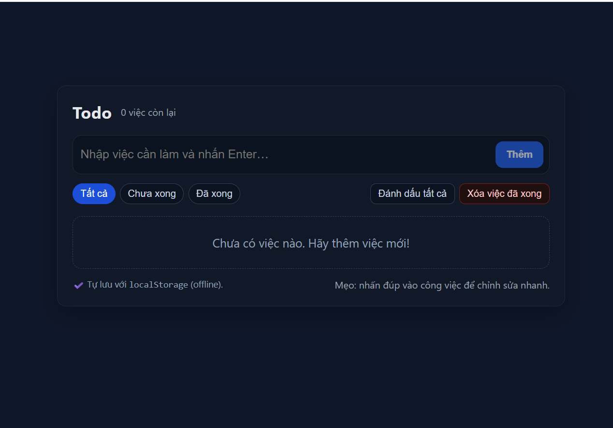

# Todo App

Ứng dụng **Todo App** là một ứng dụng quản lý công việc (to-do list) đơn giản, trực quan, giúp bạn dễ dàng thêm, xóa, và theo dõi nhiệm vụ (tasks) cần làm. Ứng dụng đang được triển khai trực tiếp tại:  
https://todo-eitgvstlp-duc-1255ms-projects.vercel.app/

---

##  Giới thiệu

Ứng dụng này được phát triển nhằm mục đích:
- Tối ưu học tập và thực hành frontend (HTML, CSS, JavaScript).
- Cung cấp một nền tảng đơn giản để quản lý công việc hàng ngày.
- Là dự án cá nhân giúp bạn khám phá cách triển khai và deploy ứng dụng lên Vercel.

---

##  Tính năng

- Thêm nhiệm vụ mới.
- Xóa nhiệm vụ đã hoàn thành.
- Tổ chức nhiệm vụ theo từng trạng thái (đang làm, đã hoàn thành).
- Giao diện thân thiện, responsive, có thể dùng trên cả web và mobile.

*(Bạn có thể bổ sung thêm nếu có chức năng như lưu trữ localStorage, drag-and-drop, hẹn giờ…)*
  
---

##  Demo

> Hãy truy cập liên kết dưới đây để xem ứng dụng hoạt động:  
> **Live Demo**: https://todo-eitgvstlp-duc-1255ms-projects.vercel.app/
<p align="left">
  <a href="https://todo-eitgvstlp-duc-1255ms-projects.vercel.app/">
    


---

##  Cài đặt & Chạy ứng dụng

Nếu bạn muốn chạy ứng dụng này trên máy của mình, chỉ cần làm theo các bước sau:

```bash
# Clone repo về máy
git clone https://github.com/USERNAME/todo-app.git
cd todo-app

# Cài đặt dependencies (nếu có)
npm install         # hoặc yarn install

# Chạy ứng dụng ở chế độ phát triển
npm run dev         # hoặc yarn dev

# Mở trình duyệt truy cập
http://localhost:3000
